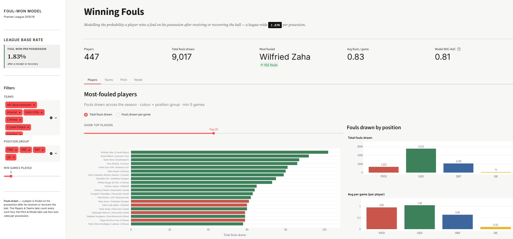
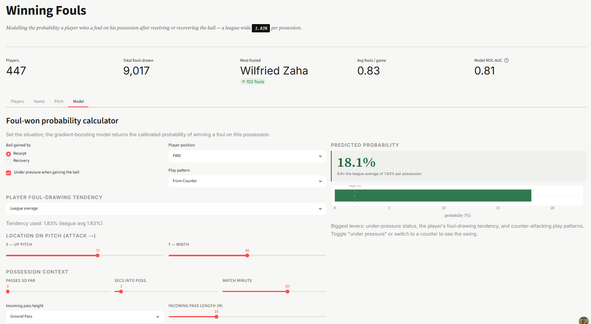

# Foul-Won Modeling & Analytics — Premier League 2015/16

Predicting the probability that a player **wins a foul on his possession** after he receives or recovers the ball — built on detailed match-event data — plus an interactive Streamlit dashboard to explore who draws fouls, where they happen, and what drives them.

[](https://foulprediction-cjzv4kdpsc5mwmq2dtnfzf.streamlit.app/)


---

## Overview

Drawing fouls is a quietly valuable skill — it halts opposition transitions, earns set-piece territory, and draws cards, and some players do it far more than others. This project models, for **every** ball reception or recovery in the 2015/16 Premier League (323,322 of them), the calibrated probability that the player wins a foul before giving the ball up, and ships an analytics dashboard on top of the same data.

## Live dashboard

**[Open the dashboard →](https://foulprediction-cjzv4kdpsc5mwmq2dtnfzf.streamlit.app/)**

Four tabs:

| Tab | What it shows |
|---|---|
| **Players** | Most-fouled players — totals, per-game rates, by position |
| **Teams** | League table of fouls drawn; click a club for its top 5 foul-winners |
| **Pitch** | Foul-won rate by pitch location, play pattern, and receipt vs recovery |
| **Model** | Set a situation and get the calibrated foul-win probability live |





## Key results

| Metric | Value |
|---|---|
| Touches modeled | 323,322 |
| Base rate (foul won / possession) | 1.83% |
| Top-decile capture | ~47% of all fouls in 10% of touches |
| Calibration | reliable overall **and** within subgroups |

**What drives it:** being *under pressure* when you get the ball, *who the player is* (a learned foul-drawing tendency), and *play pattern* (counter-attacks draw fouls ~5× the average).

## How the model works

### Target

The unit is a **touch** — a successful ball receipt or a ball recovery (323,322 in the season). A touch is labeled `1` if a foul won credited to **the same player** occurs in the **same possession** before he gives the ball up, and `0` otherwise. The defender's foul that immediately precedes the foul won is handled so the canonical chain *receive → carry → fouled* is captured. About 65% of the season's fouls trace back to a tracked receipt/recovery; the rest follow clearances, 50/50s, and set pieces and are out of scope.

### Features

Almost everything is engineered — the raw event log doesn't contain these columns:

- **Spatial** — pitch location plus distances to goal, own goal, touchline, and center.
- **Pressure & context** — under-pressure flag, play pattern (counters draw fouls ~5×), position group.
- **Possession context** — how deep into the possession the touch occurs (passes already made, time elapsed), computed by walking the event stream — the transition-vs-settled signal.
- **Incoming pass** — the delivering pass's length and height, joined onto the receipt (recoveries have none, which is itself informative).
- **Player foul-drawing tendency** — the standout feature. Drawing fouls is a skill with a ~25× spread across players, so player identity is highly predictive but dangerous to encode naively. It is computed **out-of-fold** within the training set (grouped by match, so a player's value never uses his own match) and **smoothed** toward the league rate so thin-sample players regress to the mean — leakage-safe by construction.

### Training & validation

- **Split** — grouped 80/20 by match, so no match appears in both train and test (prevents within-match leakage). Robustness is checked with a temporal split and 5-fold grouped cross-validation (ROC-AUC 0.800 ± 0.003).
- **Model** — histogram gradient boosting: it captures the non-monotonic spatial effects, learns feature interactions, handles missing values natively, and stays calibrated on a rare target without class reweighting. Probabilities are left unweighted to preserve calibration.
- **Evaluation** — accuracy is meaningless at a 1.8% base rate (the model never exceeds ~0.4, so a 0.5 cutoff predicts nothing), so evaluation is threshold-free and probability-first: ROC/PR-AUC, log loss and Brier skill scores, calibration (overall and by subgroup), precision/recall by threshold, top-K targeting, segment performance, error analysis, and partial dependence — all in the notebook.

### Model comparison

| Model | ROC-AUC | PR-AUC | Log loss | Brier |
|-------|---------|--------|----------|-------|
| Baseline (base rate) | 0.500 | 0.018 | 0.0908 | 0.01783 |
| Logistic Regression | 0.794 | 0.089 | 0.0794 | 0.01718 |
| Random Forest | 0.807 | 0.094 | 0.0782 | 0.01711 |
| **Gradient Boosting** | **0.809** | **0.099** | **0.0779** | **0.01706** |

A feature ablation confirms the story: the player tendency alone reaches a third of the full PR-AUC, the top three features (player + pressure + play pattern) recover ~75% of it, and removing pressure hurts most while removing pitch location barely registers. The model class is not the lever — the two ensembles cluster, and both beat logistic regression because of the non-linearity and interactions.

## Repository structure

```
.
├── app.py                  # Streamlit dashboard (single file)
├── requirements.txt
├── .streamlit/
│   └── config.toml         # theme
├── data/
│   ├── gains.parquet       # one row per ball reception/recovery (features + label)
│   ├── player_stats.csv
│   └── team_stats.csv
└── modeling/
    ├── foul_won_model.ipynb   # full analysis: EDA → features → model → evaluation
    └── foul_won_model.html    # rendered, no setup required to read
```

## Run locally

**Dashboard**
```bash
pip install -r requirements.txt
streamlit run app.py
```

**Notebook** (re-runs the full analysis from the raw event CSVs)
```bash
cd modeling
jupyter notebook foul_won_model.ipynb
```
> The raw event file (~486 MB) is not committed (exceeds GitHub limits). Point the notebook's two path variables at your local copy of the data to re-execute. The committed `.html` is fully rendered and needs no setup.

## Data

Event-level match data for the 2015/16 Premier League season — 380 matches, ~1.3M events.

## Tech stack

`Python` · `pandas` · `scikit-learn` · `Plotly` · `Streamlit`

## Author

**Julian Ngoh** — [GitHub](https://github.com/jngoh24)
